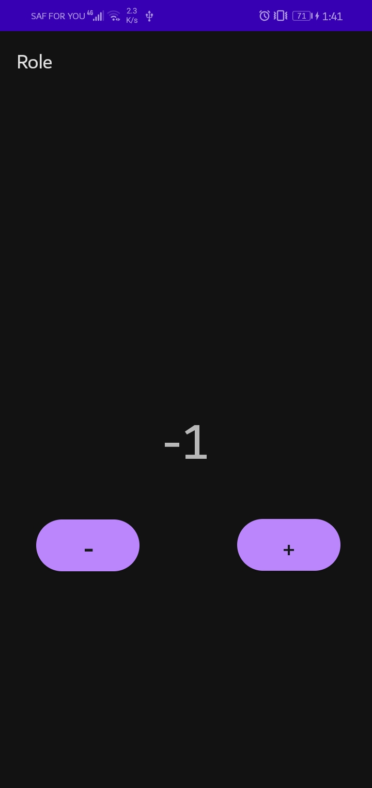

## ZURIBOARD ASSIGNMENTS

# Description

A simple Hello World Mobile app challenge that has a button that increases the count of a number by 1(displayed on a textView) when it is clicked.

# Screenshots
Demo of how the app diplays increment and decrement.

 

